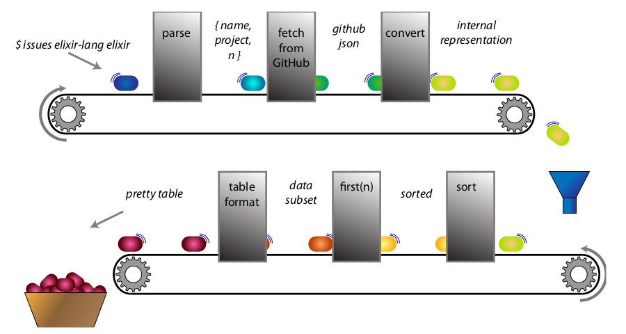

# Issues

## Descrição

Esse projeto foi feito com base no projeto do capitulo 13 do livro [Programming Elixir 1.6 - Functional |> Concurrent |> Pragmatic |> Fun](https://www.amazon.com.br/Programming-Elixir-1-6-Dave-Thomas/dp/1680502999), que tem como objetivo criar um CLI (Command Line Interface) que irá buscar as issues mais antigas de um repositório do github.


Fonte: Imagem retirada do livro citado.

## Como executar o CLI

Clone o projeto, entre dentro do diretório e então execute:

```shell
➜ mix escript.build

➜ ./issues [user] [project] [count // default = 4]
```

A CLI irá receber três parâmetros:

- **User** - dono/user do repositório no github;
- **Project** - projeto onde as issues serão buscadas;
- **Count** - número máximo de issues a serem buscadas.

## Conhecimentos Utilizados

- **mix new [project_name]**
- **OptionParser.parse/2**: Biblioteca built-in utilizada para pegar os parâmetros passados no CLI.
- **mix deps**: Comando utilizado para listar todas as dependências do projeto e sua situação/status.
- **mix deps.get**: Comando utilizado para pegar (download, install, resolução de conflitos, etc) todas as dependências do projeto.
- **HTTPoison**: Biblioteca externa que fornece um cliente HTTP, que será utilizado para consumir a API do GitHub.
- **Poison**: Biblioteca externa que fornece formas de converter JSON em uma estrutura de dados do elixir.
- **Mix.Config**: Utilizado para definir configurações para o projeto e para separar configurações de acordo com o ambiente em que o projeto está sendo executado.
- **ExUnit.CaptureIO.capture_io/1**: Utilizado para capturar o resultado enviado para o stdout.
- **mix escript.build**: Comando utilizado para gerar o "executável" do código.
